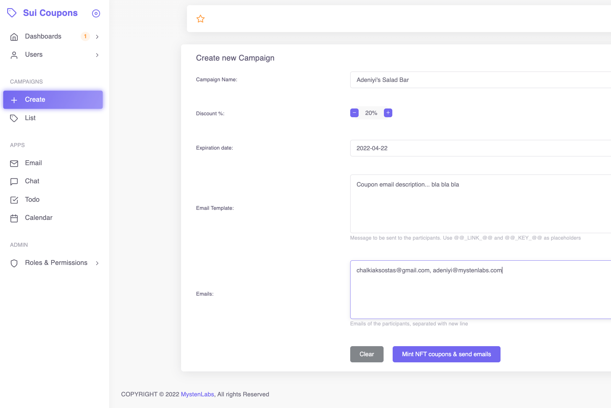
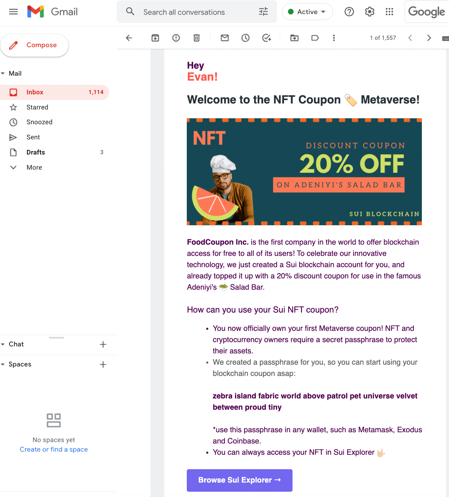
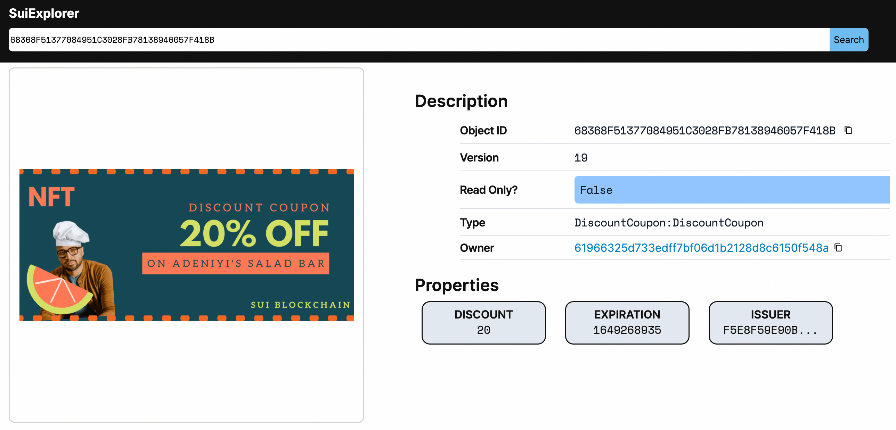

# Sui Coupon Demo

Sui Coupons is a PoC 1-week hackathon project that demonstrates the effectiveness of combining the expressivity features
of the Move language, with Sui's unique design and speed, in order to provide a novel Web3.0 user on-boarding mechanism 
via NFT coupon air-drops.

The objective is to offer a tool for merchants that incentivizes and helps their users to have a smooth blockchain
on-boarding experience, by removing the account and passphrase generation friction, which usually demotivates 
the average non-technical person from entering the crypto space in the first place. 

## Why crypto on-boarding is slow?
There have been many attempts in the past to measure blockchain user on-boarding success rates, but many of them 
introduce even more complex protocols and technical terms, such as lazy minting, layer-2 solutions, custodial services 
(where the self-sovereignty concept is unfortunately absent) and MetaMask self-custody wallets via mnemonics. What is 
usually **missed** however is:
- a strong incentive for users to tolerate the time-consuming process of understanding the technical details before they use it
- a "try me first for free" principle
- users cannot use an account if it's not already topped up with a minimum amount of coins (required to pay for gas)
- addresses are not actually visible on-chain before a first transaction occurs (so they miss the feeling of real ownership)
- in some NFT air-dropping solutions, such as lazy minting, the assets are not available on the blockchain explorers and thus, the users are locked in show-casing platforms.
- layer-2 minting and related flows are very complex terms for the average user to digest
- many of the above issues exist because in many blockchains transactions are either expensive or very slow to allow for massive user on-boarding campaigns (i.e., giving away assets).

## The Sui Coupon protocol
Sui has unique features by design; it can almost scale indefinitely, offer record numbers in transaction speed and 
latency, thus reducing the per-transaction cost, and provide batching which allows for blazing fast air-dropping, 
directly to layer-1 and not externally.

Sui Coupons takes advantage of the aforementioned facts to reasonably solve most of the on-boarding problems, focusing 
on users who never used a blockchain wallet in the past.

In Layman's terms the protocol is very simple and works as follows (per user): A merchant issues a coupon in the form of
NFT Vs the conventional way of sharing coupon codes. To achieve this, it creates a Sui account and mnemonic for this 
user, it mints a discount coupon NFT and transfers it along with some minimal SUI coins to the user's just generated Sui 
address, and it finally emails the Sui explorer-link along with the pre-generated mnemonic to user's email address.  

Each user will receive an email where they can see their mnemonic, but most importantly a link to browse their asset, 
their first on-chain NFT. Now, users who expect to spend their coupon are motivated to enroll to any wallet by entering 
their mnemonic (or use QR-code). Interestingly, everyone can socially share their NFT-link with friends, even before 
opening any wallet app. We expect that these social elements will boost word of mouth and adoption of the coupon NFT idea.

## Key Management
From the merchant's point of view, note that in this demo we utilize deterministic key generation, where each merchant 
only needs a single secret key (`seed`) to deterministically generate the mnemonic phrase for every user. The key 
management is as easy as possible by only requiring to protect the secret seed, because every user-mnemonic can always 
be derived whenever required. 

Merchants who want to follow a mint-and-forget policy, they could even delete the `seed` 
after minting and e-mailing users. Obviously in the above scenario user mnemonic recovery will not be possible, but at 
the same time the merchant is not requiring to run (or be considered) a custody service.

## Sui Coupon extensions
Note that Sui supports batched transactions from the same account, which is a very useful feature in the coupon scenario 
as the merchant can force minting for multiple user in one mega transaction.

Additionally, we are working in a multi-signer batch transaction model, which will allow for spending an NFT even without 
owning the required Sui gas amount. We expect that because of Sui's low costs per transaction, many 3rd party services will 
be willing to help users move their assets by tipping the user-transaction with the gas required. This extension is WIP.

## Application Components
This project required the implementation or enhancements to the following 5 high-level components:
* the Move implementation of a simple Coupon NFT, available at [`DiscountCoupon`](https://github.com/MystenLabs/sui/tree/sui-coupon-v0/sui_programmability/framework/sources/DiscountCoupon.move)
* a new Rest server end-point to support the `mint_and_topup` coupon POST request, available at [`rest_server.rs`](https://github.com/MystenLabs/sui/tree/sui-coupon-v0/sui/src/rest_server.rs)
* a basic Rust Mail server to provide the coupon email template and submit emails via smtp server, available at [`coupon_utils.rs`](https://github.com/MystenLabs/sui/tree/sui-coupon-v0/sui/src/coupon_utils.rs)
* a Node JS server + frontend for the Coupon issuing Dashboard, available at [`examples/coupons/`](https://github.com/MystenLabs/sui/tree/sui-coupon-v0/examples/coupons/)
* small updates to sui-explorer for NFT coupon templated show-casing, available at  [`explorer/client/`](https://github.com/MystenLabs/sui/tree/sui-coupon-v0/explorer/client/).

**Fig.1 Coupon Issuing -  Dashboard Main** 


**Fig.2 Coupon Issuing -  Dashboard Minting Form**



**Fig.3 Coupon Email**



**Fig.4 Coupon Explorer View**



## Getting Started

**Install Rust's cargo**

Sui is written in Rust, and we are using Cargo to build and manage the dependencies. As a prerequisite, you will need to 
install Cargo version 1.59.0 or higher in order to build and install Sui on your machine: [`cargo installation`](https://doc.rust-lang.org/cargo/getting-started/installation.html)

Download and Install Sui from our GitHub repo
```
git clone --branch sui-coupon-v0 https://github.com/MystenLabs/sui.git
```

**Install Node JS**

[`Node JS installation`](https://nodejs.org/en/download/)

---
**Prerequisites - Before running**

Set the following path variables, i.e., to temporarily set the in a MAC do:

```coupon_explorer-min
export MAILER_SMTP=<S>
export MAILER_USER=<U>
export MAILER_PWD=<P>         
export COUPON_KMS_SEED=<K>
```

Replace `<S>` with your smtp, i.e., `smtp.gmail.com`

Replace `<U>` with your email address, i.e., `coupon@gmail.com`

Replace `<P>` with your email password, i.e., `smtp.gmail.com`

Replace `<K>` with a random seed string, i.e., `fdashkfjs7987fds`

---
## Execute Sui Coupons locally

### Rust Server (runs on port 5001)
Under `sui` directory run:
```
cargo build --release
./target/release/rest_server
```

Open another terminal (or use Postman)
```
curl --location --request POST 'http://127.0.0.1:5001/sui/genesis' \
--header 'Content-Type: application/json' \
--data-raw '{
"custom": false
}'
```

Then run:
```
curl --location --request POST 'http://127.0.0.1:5001/sui/start'
```

Note: You can stop the rest server by:
```
curl --location --request POST 'http://127.0.0.1:5001/sui/stop’
```
---
### Dashboard (runs on port 3001)
Under `sui` directory run:
```
cd examples/coupon
npm i --force
npm run build
npm start -- -p 3001
```
---
### Explorer (runs on port 3000)
Under `sui` directory run:
```
cd explorer/client
npm install
npm start
```
